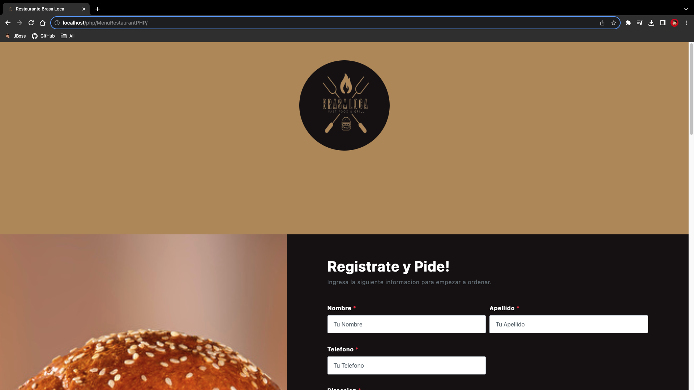
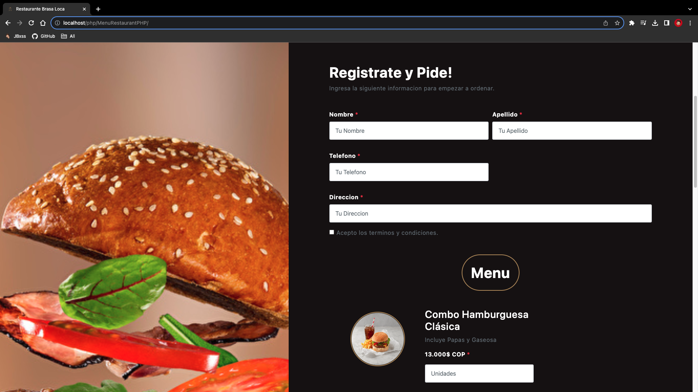
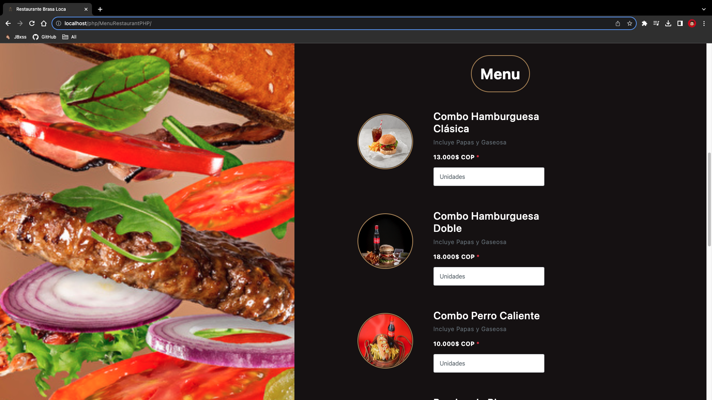

# Menú en PHP de Brasas Locas

Este proyecto es una aplicación web simple desarrollada en PHP que muestra el menú del restaurante "Brasas Locas". Los clientes pueden ver los platos disponibles, sus descripciones y precios.

## Capturas de Pantalla


*Página de Inicio de Brasas Locas*


*Seccion de Registro de Brasas Locas*


*Seccion de Menu de Brasas Locas*

## Funcionalidad

La aplicación del menú de "Brasas Locas" cuenta con las siguientes características y funcionalidades:

- **Visualización de Platos:** Los clientes pueden navegar por una lista de platos disponibles en el restaurante, incluyendo imágenes, descripciones y precios.

- **Pedidos y Reservas:** Los clientes pueden realizar pedidos directamente desde la aplicación. Esto implica proporcionar información de contacto y seleccionar la cantidad deseada de cada plato.

- **Interfaz Intuitiva:** La interfaz de usuario está diseñada de manera amigable y fácil de usar, lo que garantiza una experiencia agradable para los clientes que exploran el menú en línea.

- **Administración de Contenido:** Los propietarios del restaurante pueden registrarse en una sección de administración segura para agregar, editar o eliminar platos, actualizar precios y gestionar las reservas.

Esta aplicación proporciona una solución completa para que "Brasas Locas" muestre su menú en línea y permita a los clientes interactuar de manera eficiente con la oferta del restaurante.

## Cómo Usar

Para ejecutar este proyecto en tu entorno local, sigue estos pasos:

1. **Requisitos Previos:**

   Asegúrate de tener instalado PHP y un servidor web (por ejemplo, Apache) en tu máquina.

2. **Clonar el Repositorio:**

   ```bash
   git clone https://github.com/JBxss/MenuRestaurant.git
   ```

3. **Iniciar el Servidor Web:**

   - Inicia tu servidor web y asegúrate de que PHP esté habilitado.

4. **Ejecución:**

   - Abre un navegador web y accede a la URL local donde has alojado el proyecto, por ejemplo, `http://localhost/MenuRestaurant/index.php`.

---

¡Esperamos que disfrutes explorando el menú en línea de "Brasas Locas"! Si tienes alguna pregunta o sugerencia, no dudes en abrir un issue o contactame.
